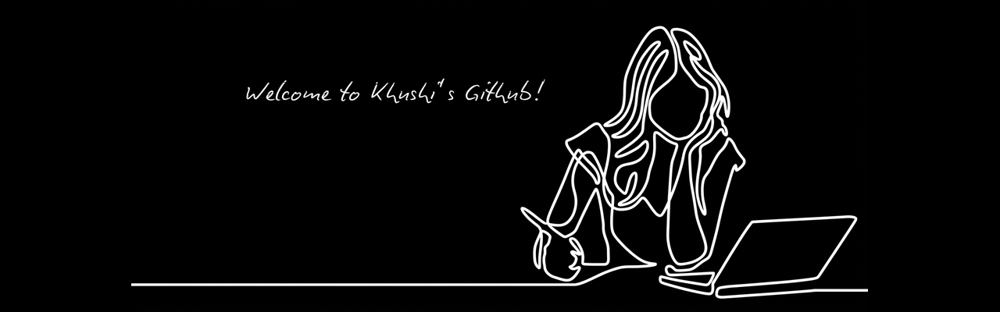

  

<h1 align="center">Hi! I'm Khushi Meshram</h1>

<h3 align="center">
  Software Engineer · Full-Stack Developer 
</h3>

  I enjoy understanding things from first principles and building from there.

---

## About Me

I’m a Software Engineer who enjoys understanding how things work beneath the abstractions and building from that understanding.

- 🔭 Currently working on **full-stack applications & AI systems**
- 🌱 Exploring **MERN, system design, AI/LLM integration & software engineering**
- 🧠 Interested in understanding how things work beneath the abstractions
- 💻 I enjoy turning ideas into functional products
- 🎯 Focused on becoming a stronger problem solver and engineer

---

## Technologies

### Languages

  

### Frontend

  

### Backend & Database

  

### AI & Development

  

---

## Connect

  
  
  

---

  <i>Build with curiosity. Understand deeply. Keep improving.</i>

